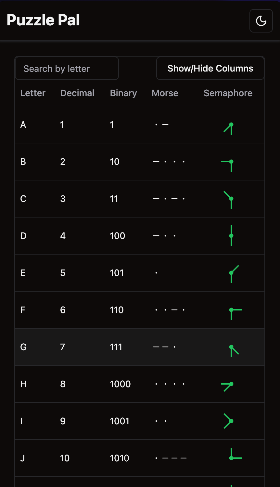
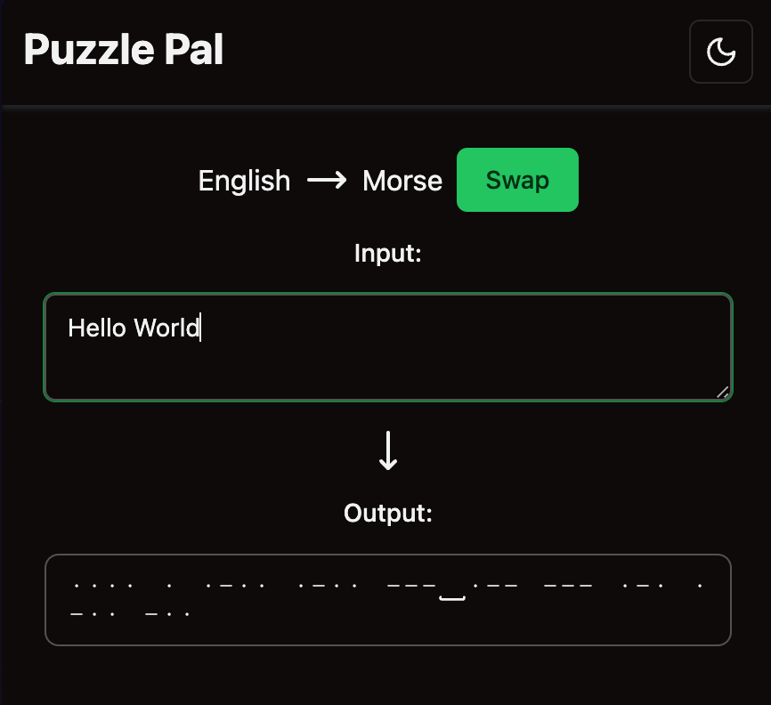
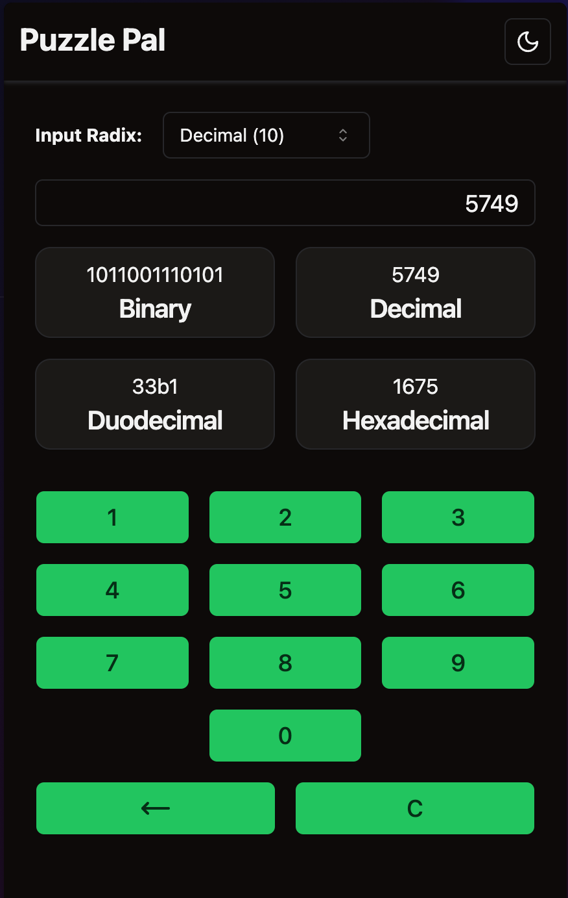
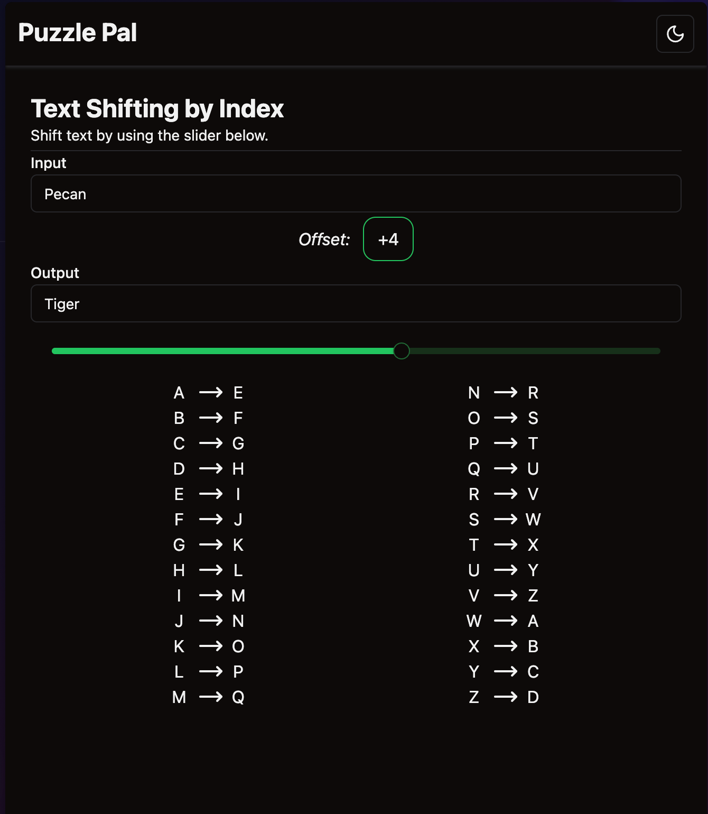

# Puzzle Pal

A resource to provide tools to address common puzzle-solving tasks, like lookups, simple ciphers, and translations. I plan to add more tools naturally as I think of them during my regular puzzle sessions.

Hosted at [https://puzzlepal.vercel.app](https://puzzlepal.vercel.app).

## Screenshots

